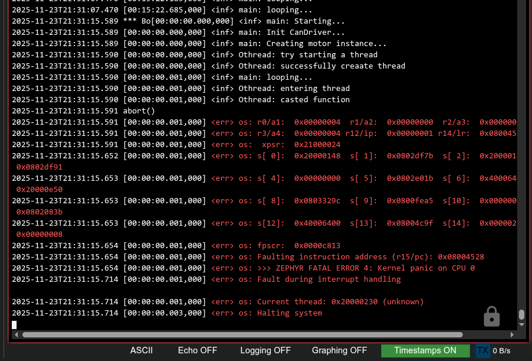

+++
title = '记一次嵌入式Debug经历 - addr2line'
date = 2025-11-15T21:00:50+08:00
draft = false
description = "一次Zephyr平台下Debug的过程"
slug = ""
image = "1.png"
categories = ["编程相关","Zephyr"]
tags = ["Zephyr", "C/C++", "调试", "编译器"]
weight = 1
keywords = ["Zephyr", "C/C++", "调试", "编译器"]
readingTime = true
+++

## 序

在开发[OneMotor](https://github.com/RoboMaster-DLMU-CONE/OneMotor)的过程中，在跑 Zephyr 平台上的电机的时候遇到一个很难找的 Bug。

> 
> 日志截图

经过反复定位，得知 Bug 触发的位置应该在下列代码附近：

```cpp

MotorManager::MotorManager()
    {
        thread_ = std::make_unique<Thread::Othread>([&]()
        {
            while (!stop_.load(std::memory_order_acquire))
            {
                for (auto& [driver, driver_buffers] : driver_motor_outputs)
                {
                    // 直接从读取缓冲区获取数据
                    auto* read_buffer = driver_buffers.current_read_buffer.load(std::memory_order_acquire);

                    Can::CanFrame frame;
                    frame.dlc = 8;
                    frame.id = 0x200;
                    std::copy_n(read_buffer->data(), 8, frame.data);

                    // Debug时总线上能收到一次CAN消息
                    auto result = driver->send(frame);

                    static constexpr uint8_t zero_bytes[8] = {0};
                    if (memcmp(read_buffer->data() + 8, zero_bytes, 8) != 0)
                    {   // 没有进入这个分支
                        frame.id = 0x1FF;
                        std::copy_n(read_buffer->data() + 8, 8, frame.data);
                        result = driver->send(frame);
                    }
                    if (!result)
                    {
                        //不知道是不是这里panic了
                        panic("Failed to send CAN Message in MotorManager");
                    }
                }

                Thread::sleep_for(std::chrono::milliseconds(1));
            }
        }
    }
```

## 尝试

- 我尝试了为 `panic` 加上 `LOG_ERR`：

```cpp
LOG_MODULE_REGISTER(OneMotor, CONFIG_LOG_DEFAULT_LEVEL);

namespace OneMotor
{
    void panic(const std::string&& message)
    {
        LOG_ERR("%s", message.c_str());
        k_panic();
    }
}
```

但是报错的日志里仍然没有出现`LOG_ERR`；

- 尝试为双缓冲区读写再加一层`k_mutex`，仍然报错

- 尝试直接删除分支，不再进行`can_send`操作，仍然报错

到这里，其实事情就有点眉目了。我感觉报错大概率不是`MotorManager`里的问题。

## 破局

面对这种不知道何处下手的疑难报错，我们可以使用`addr2line`等`Binutils`工具对日志中出现问题的堆栈进行分析。

### addr2line 工具简介

`addr2line` 是一个强大的调试工具，属于 GNU Binutils 工具集的一部分。它的主要功能是将程序中的地址（内存地址）转换为对应的文件名和行号。这在分析程序崩溃（Crash）或内核恐慌（Kernel Panic）时的堆栈跟踪信息非常有用。

#### 基本用法

```bash
addr2line [选项] [地址]
```

通常我们需要配合带有调试信息（Debug Symbols）的可执行文件（如 `.elf` 文件）使用。

#### 常用参数

- `-e <executable>` 或 `--exe=<executable>`：指定要分析的可执行文件路径。
- `-f` 或 `--functions>`：显示函数名称。
- `-C` 或 `--demangle`：将 C++ 的修饰名（mangled name）还原为人类可读的函数签名。
- `-p` 或 `--pretty-print`：让输出更易读，将所有信息打印在一行。

### 调试过程

#### 栈地址信息

先从日志中获取可以使用的报错栈地址信息

日志信息：

```plaintext
2025-11-23T21:48:11.233 [00:00:00.001,000] <err> os: r0/a1:  0x00000004  r1/a2:  0x00000000  r2/a3:  0x00000001
2025-11-23T21:48:11.233 [00:00:00.001,000] <err> os: r3/a4:  0x00000004 r12/ip:  0x00000001 r14/lr:  0x080044d9
2025-11-23T21:48:11.234 [00:00:00.001,000] <err> os:  xpsr:  0x21000024
2025-11-23T21:48:11.293 [00:00:00.001,000] <err> os: s[ 0]:  0x20000148  s[ 1]:  0x0802df37  s[ 2]:  0x20000148  s[ 3]:  0x0802df4d
2025-11-23T21:48:11.293 [00:00:00.001,000] <err> os: s[ 4]:  0x00000000  s[ 5]:  0x0802dfd7  s[ 6]:  0x40006400  s[ 7]:  0x20000e50
2025-11-23T21:48:11.294 [00:00:00.001,000] <err> os: s[ 8]:  0x08033258  s[ 9]:  0x0800fe61  s[10]:  0x00000000  s[11]:  0x080207f7
2025-11-23T21:48:11.294 [00:00:00.001,000] <err> os: s[12]:  0x40006400  s[13]:  0x08004c5f  s[14]:  0x00000201  s[15]:  0x00000008
2025-11-23T21:48:11.295 [00:00:00.001,000] <err> os: fpscr:  0x00007a02
2025-11-23T21:48:11.296 [00:00:00.001,000] <err> os: Faulting instruction address (r15/pc): 0x080044e8
2025-11-23T21:48:11.296 [00:00:00.001,000] <err> os: >>> ZEPHYR FATAL ERROR 4: Kernel panic on CPU 0
2025-11-23T21:48:11.355 [00:00:00.001,000] <err> os: Fault during interrupt handling

2025-11-23T21:48:11.356 [00:00:00.001,000] <err> os: Current thread: 0x20000230 (unknown)
2025-11-23T21:48:11.356 [00:00:00.002,000] <err> os: Halting system
```

- `r15/pc`：Program Counter，当前指令地址；

```plaintext
<err> os: Faulting instruction address (r15/pc): 0x080044e8
```

- `r14/lr`：Link Register，保存函数返回地址；

```plaintext
0x00000001 r14/lr:  0x080044d9
```

- 日志中剩余的通用寄存器的地址含义也可以通过查询 Arm Cortex-M 芯片手册得知。

- s 打头的的内容是浮点寄存器 S0~S15 的内容，可以用来分析浮点任务，和调用栈无关。

#### 分析栈地址

先把`PC`、`LR`寄存器的值喂给`addr2line`；

```bash
~/zephyr-sdk-0.17.4/arm-zephyr-eabi/bin/arm-zephyr-eabi-addr2line -f -C -e build/zephyr/zephyr.elf 0x080044d9 0x080044e8
__set_BASEPRI
/home/wf/codings/zephyr_workspace/modules/hal/cmsis_6/CMSIS/Core/Include/m-profile/cmsis_gcc_m.h:451
abort
/home/wf/codings/zephyr_workspace/zephyr/lib/libc/common/source/stdlib/abort.c:14
```

我们可以看到程序崩溃的位置来源于 cmsis_gcc_m.h 的\_\_set_BASEPRI 和 stdlib 的 abort 函数。

如何顺着这个线索继续往下查找呢？我们可以到日志里继续将`0x0800xxxx`类似的地址喂给`addr2line`。为什么呢？这是因为在 STM32/Zephyr 的默认链接脚本里，指令代码段（.text）放在片上 Flash，地址从 0x08000000 起。因此凡是落在 0x0800xxxx（或更大的 0x0802xxxx、0x0803xxxx…）范围的数值，十有八九就是某个函数或指令的地址；把这些值丢进 addr2line 就能还原函数/行号。相反，RAM 位于 0x2000xxxx，所以像 0x20000148 这类值通常是数据/栈指针，不需要 addr2line。

```bash
~/zephyr-sdk-0.17.4/arm-zephyr-eabi/bin/arm-zephyr-eabi-addr2line -f -C -e build/zephyr/zephyr.elf 0x0800fe61 0x080207f7 0x08004c5f 0x080044e8
std::__throw_bad_function_call()
??:?
OneMotor::Can::rx_callback_entry(device const*, can_frame*, void*)
/home/wf/codings/zephyr_workspace/modules/lib/onemotor/src/Can/Z_CanDriver.cpp:15
can_stm32_rx_isr_handler
/home/wf/codings/zephyr_workspace/zephyr/drivers/can/can_stm32_bxcan.c:147
abort
/home/wf/codings/zephyr_workspace/zephyr/lib/libc/common/source/stdlib/abort.c:14
```

这样我们就能找到报错的真实来源：并非来源于`MotorManager`，而是八百里之外的`CanDriver`类的`rx_callback_entry`！

#### 分析代码

以下是`rx_callback_entry`的代码：

```cpp
tl::expected<void, Error> CanDriver::registerCallback(const std::set<size_t>& can_ids, CallbackFunc func)
    {
        for (const auto& id : can_ids)
        {
            if (id > 2048) return unexpected(Error{CanDriverInternalError, "specified CAN ID has exceeded 2048."});
            if (auto it = filters.find(id); it != filters.end())
            {
                can_remove_rx_filter(can_dev, it->second.second);
                filters.erase(it);
                callbacks.erase(id);
            }
            callbacks[id] = func;
            const auto filter = can_filter{
                .id = id,
                .mask = CAN_STD_ID_MASK,
                .flags = 0U,
            };
            int filter_id = can_add_rx_filter(can_dev, rx_callback_entry, &func, &filter);
            if (filter_id < 0)
            {
                return unexpected(Error{CanDriverInternalError, strerror(-filter_id)});
            }
            filters[id] = {filter, filter_id};
        }
        return {};
    }
```

结合刚才找到的报错函数堆栈：

```cpp
std::__throw_bad_function_call()
??:?
OneMotor::Can::rx_callback_entry(device const*, can_frame*, void*)
/home/wf/codings/zephyr_workspace/modules/lib/onemotor/src/Can/Z_CanDriver.cpp:15
can_stm32_rx_isr_handler
/home/wf/codings/zephyr_workspace/zephyr/drivers/can/can_stm32_bxcan.c:147
```

首先，`__throw_bad_function_call()`是`std::function`发出的报错。详见 cppreference 内容：

> std::bad_function_call is the type of the exception thrown by std::function::operator() if the function wrapper has no target.

这就将怀疑对象直接缩小到了使用 std::function 的位置：

```cpp

```
