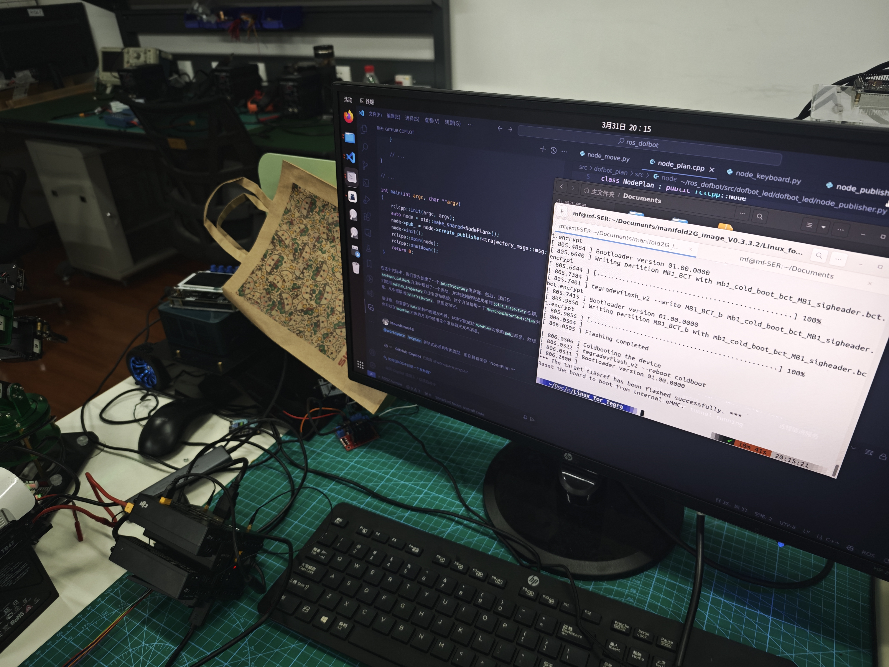
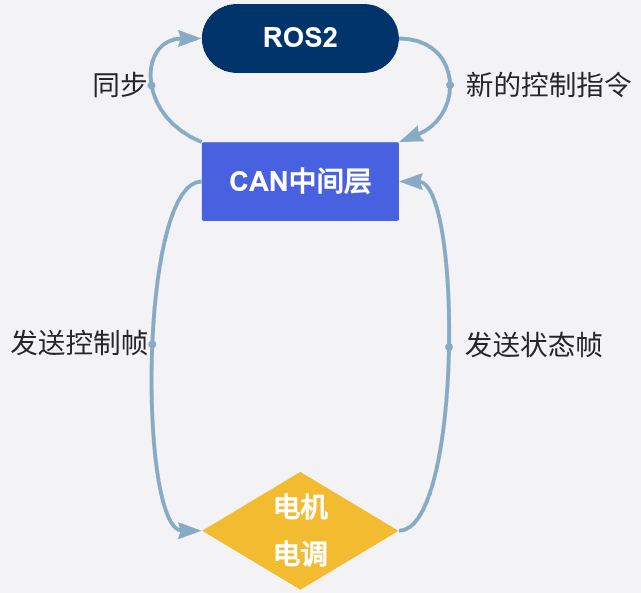
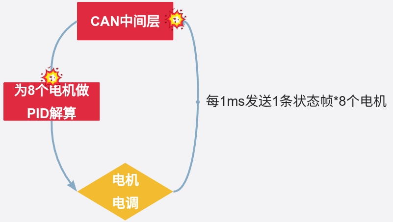
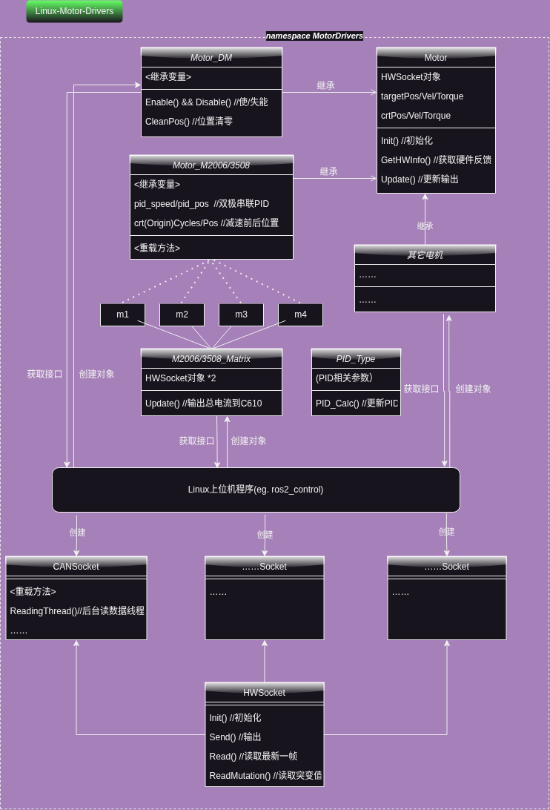
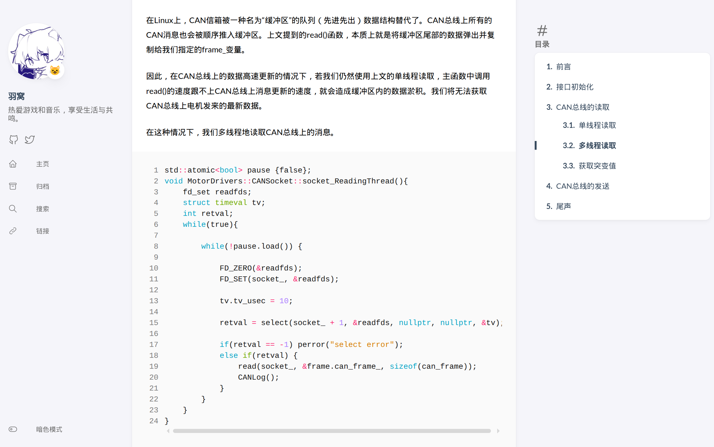

+++
title = '一年的坚守与回顾 - 我与 Linux CAN 通信框架的故事'
date = 2025-11-25T11:26:53+08:00
draft = false
description = "一年的坚守与回顾 - 我与 Linux CAN 通信框架的故事"
slug = ""
image = "1.png"
categories = ["编程相关","Linux"]
tags = ["Linux", "C/C++", "CAN", "HyCAN", "驱动", "开发"]
weight = 1
keywords = ["Linux", "C/C++", "CAN", "HyCAN", "驱动", "开发", "开源"]
readingTime = true
+++

## 序

今年年底，我把我打磨很久的 CAN 通信框架开源并且发布在了各大论坛上。作为 Linux 初学者和大学生，我非常感谢网络上各位前辈对我作品的认可和斧正。在这里，我想把我自己写这个框架的一些心路历程记录下来，为这段 Linux 开发的旅程做一个简单的总结。

## 动机

我和 Linux CAN 的故事说来说来话长。大一的夏天，工作室的学长给了一台`Manifold 2-G`。这是`DJI`出品的一台嵌入式 Linux 设备，上面直接附带两个原生`CAN`口。当时我们计划把它作为我们`RoboMaster 工程机器人`的上位机，通过 CAN 直接控制机械臂电机。



这里我就不得不骂一下 DJI，好好一个机器发布完以后一点都不维护，到 2023 年跑的系统还是`Ubuntu 16.04`，手动给这个机器刷机和维护 ROS2、Docker 简直是要老命了……

抛开机器本身的问题不谈，理论上来说，用 CAN 控制电机应该是一个很简单的任务。你只需要发送控制帧，获取反馈帧，把反馈数据同步给 ros2_control 就行。



问题是，对于`DJI M3508`和一些其它的类似的电机来说，它们的电调只接受控制电流数据，不接收位置/速度之类的控制指令。那么怎样做到位置/速度控制呢？电调会在 CAN 总线上以 1000hz 的频率发送角度和速度反馈帧，我们需要根据反馈帧进行 PID 解算得到实际的控制电流，最后再发送给电调。于是整个流程就变成了这样：



在这种情况下，如果采用直接`read()`CAN 总线的方法，我们妙算里 Jetson Nano 的那颗 ARM Cortex-A57 肯定是撑不住的。于是，我开始研究 Linux 平台上怎样采取更高效的方式来读取总线，降低 CPU 占用率。

## 初次尝试

意识到这可能是一个很关键的中间件，我把电机控制逻辑和 CAN 驱动封装在了一起，开发了一个叫做[Linux-Motor-Drivers](https://gitee.com/dlmu-cone/rm-linux-motor-driver)的库。

这也是我第一次设计 Linux C++程序。当时对 C++没有太多的了解，我只是感觉：“既然要学就学最难的，啃最硬的骨头”，然后就用 AI 辅助着学会了一些面向对象的皮毛，设计了一个依赖注入的模型。



当时也不是很懂 Linux 和 Socket 模型，AI 也不是很发达，我也是探索了别人的开源库才明白，不能用阻塞轮询读取，应该用`poll`或者`select`。



### 问题

第一次写的这版“驱动”在高负载下有时会出现 SIGSEGV 的报错，同时用 C++的 iostream 开发的日志系统的性能也比较羸弱。更主要的是，我在 C++的实践上采用了大量虚函数和类继承，但是不同电机的操作逻辑往往无法耦合在一起。比如达妙电机需要额外的使能/失能操作的同时不需要像大疆电机那样反复从总线上读取消息。在这样的情况下，各个电机之间能够复用的代码往往比较少，为每一个电机添加一个父类依赖反而有些鸡肋。因此我决定对这板代码进行重构。电机控制的部分演化成了[OneMotor](https://github.com/RoboMaster-DLMU-CONE/OneMotor)，CAN 驱动的部分就演化成了`HyCAN`。

## HyCAN 的开发经历

### 关键的 epoll

这个时候我意识到一个问题，异步模型下`select`的性能仍然不够强劲。要实现总线上挂载更多个电机的目标，我必须找到更高性能的通信方法。也是在这个时候，我了解了 Linux 的 Socket 模型，认识了`epoll`。

```cpp
// create epoll_fd
epoll_fd = epoll_create(256);


```
