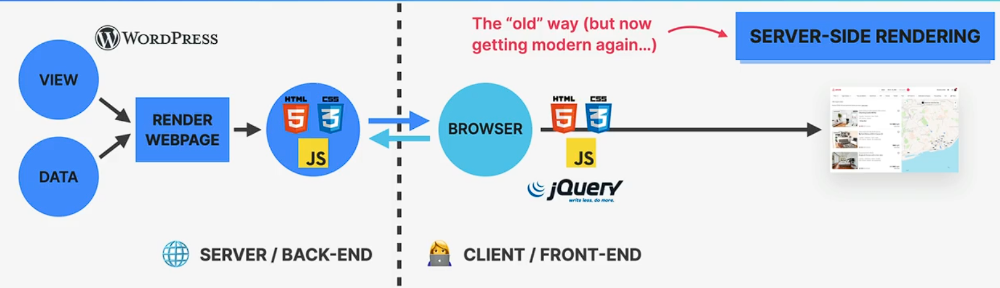
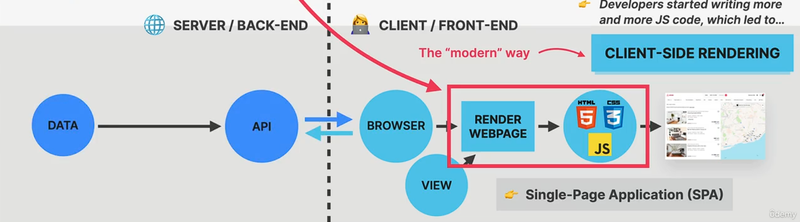
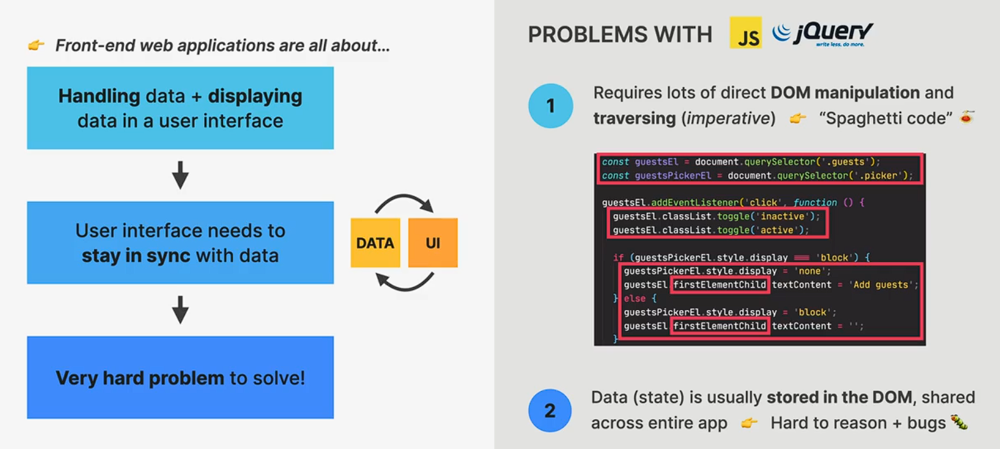

+++
title = '学习React第0章-起点'
date = 2024-09-25T16:55:52+08:00
draft = false
description = "这篇笔记介绍了React框架的起源和优势，强调了前端开发的重要性，并概述了JavaScript的基础知识，包括模板字面量、箭头函数、短路逻辑运算符、可选链和数组方法。"
slug = "LearningReact-00"
image = "image-1.png"
categories = ["编程相关","前端"]
tags = ["JavaScript","React","JSX","前端","学习笔记"]
weight = 1       # You can add weight to some posts to override the default sorting (date descending)
keywords = ["JavaScript","React","JSX","前端","学习笔记"]
readingTime = true
+++

## 前言

光有后端的开发经验是不够的。作为程序员，想让我们的产品在世人面前光鲜亮丽，就必须要学习使用各种前端框架**高效、快速**地开发`UI`。挑选厨具之后，我选择在[The Ultimate React Course](https://www.udemy.com/course/the-ultimate-react-course/)上学习`React`。

## 前端框架的由来



早期的Web开发，多以“多页应用”为主。`羽窝`就是一个多页应用。用户会向服务器请求一个页面，服务器的后端就向用户返回多页中的其中一页。这时，服务器上的后端程序真正控制着Web应用的一切。



随着时间的推移，多种因素促使这一现状发生改变：

- 智能终端兴起，市面上有越来越多不同规格的浏览器终端。前后端需要分离以高效开发不同规格的页面；
- 人们对网页丝滑效果的要求越来越高，网页开始使用越来越多的JavaScript；
- 前端职责扩宽到处理页面路由、逻辑交互等；

在2013年，随着`React`框架发布，“单页应用”兴起了。



与“多页应用”不同的是，“单页应用”使用一套引擎在前端就完成了多个页面的渲染与交互。此时，后端服务器基本上只负责提供数据相关的API供前端调用。

## React与JavaScript

JavaScript是一种前端开发语言。在React出现之前，人们可以使用JavaScript来处理网页渲染中复杂的逻辑。

对一个单页应用程序来说，页面中的大量数据都需要随时保持**同步**。使用传统的JavaScript和浏览器的DOM进行交互会十分**繁琐**。



因此，我们需要像React这样的框架辅助我们快速地构建前端程序。

## JavaScript基础

React使用`JSX`语法，意味着你需要一些前置的JavaScript技能。

### 模板字面量

```javascript
const title = "Title";
const summary = `a book titled ${title}`;
```

### 箭头函数

一种类似Lambda的函数体。`()`内表示接受的参数。

```javascript
function_with_callback(
    (e)=>{
    for(int i = e; i > 0; i--){
        console.log(i);
    }
})
```

### 短路逻辑运算符

```javascript
console.log(flag && "somestring");
```

当`flag`为`true`时，就会返回`&&`后的真值，否则返回flag。

### 可选链

```javascript
console.log(book.reviews.librarything?.reviewCount);
```

若`librarything`属性不存在，会返回`undefined`。

### 数组方法

```javascript
const x = [1,2,3,4,5].map((el)=>el*2;);
//x = [2,4,6,8,10]
const y = [1,2,3,4,5].filter((el)=>el>3);
//y = [4,5]
const z = [2,3,1,5,4].sort((a,b)=>a-b);
//z = [1,2,3,4,5]
```

这些方法都会返回一个新的数组，因此在React中十分常用。