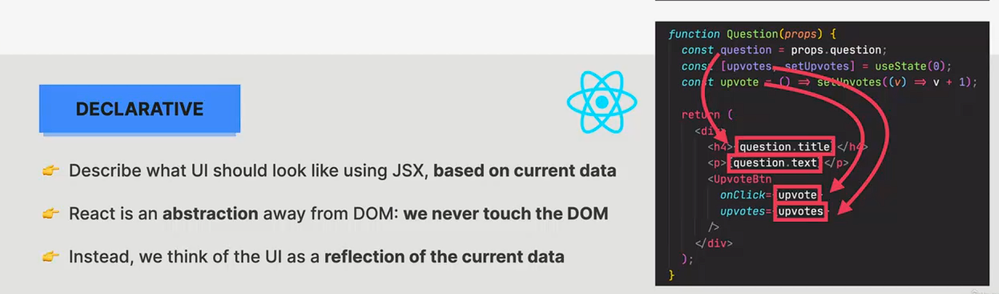
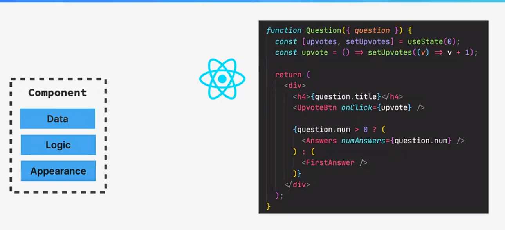
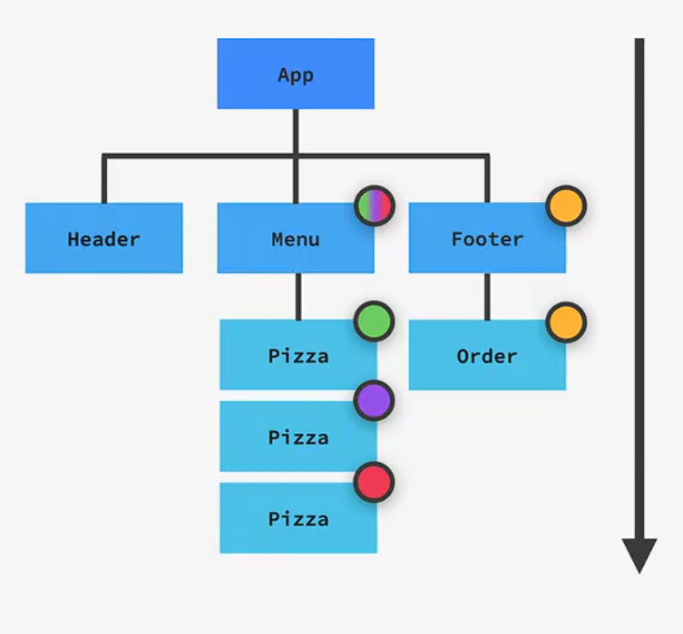
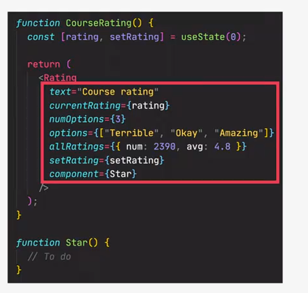
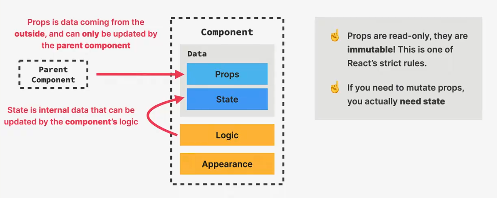
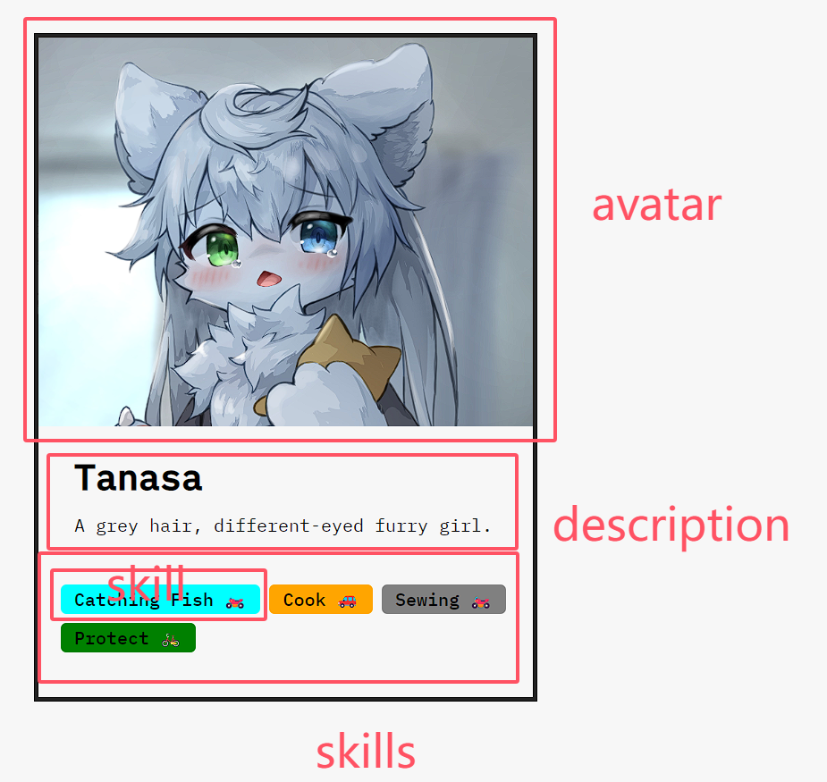
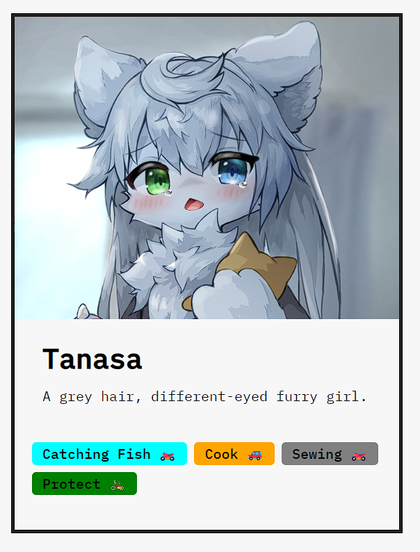

+++
title = '学习React第1章-组件与道具'
date = 2024-09-25T19:25:39+08:00
draft = false
description = "这篇笔记介绍了React的JSX语法、组件和道具的基本概念，并通过一个个人资料卡片的实例展示了如何使用这些概念构建React应用。"
slug = "学习React第1章-组件与道具"
image = "image-6.png"
categories = ["编程相关"]
tags = ["JavaScript","React","JSX","前端","学习笔记"]
weight = 1       # You can add weight to some posts to override the default sorting (date descending)
keywords = ["JavaScript","React","JSX","前端","学习笔记"]
readingTime = true
+++

## JSX

React采用“声明式”布局来书写代码，这可以让代码更好反映出真实的用户界面，加快我们的开发速度。



我们在React中使用`JSX`语言。这是一种融合了`HTML`、`CSS`、`JavaScript`的语言，最终被Babel翻译成标准的`JavaScript`。

> It is called JSX, and it is a syntax extension to JavaScript. We recommend using it with React to describe what the UI should look like. JSX may remind you of a template language, but it comes with the full power of JavaScript. ——React Doc

```javascript
function getGreeting(user) {
  if (user) {
    return <h1>Hello, {formatName(user)}!</h1>;
  }
  return <h1>Hello, Stranger.</h1>;
}
```

## 组件

React以“组件”的形式来组织整个代码。每个组件都是.js文件中的一个大写字母开头的`function`。例如，约定俗成每个React应用的组件为`function App() {}`。

使用`JavaScript`或`JSX`编写组件，意味着每个组件都将包含：

- 数据
- 逻辑
- 外观



每个组件都将`return`一段`JSX`代码，作为整个组件实际渲染的内容。

## 道具

React中，组件组成了整个用户界面。“道具”是一种在组件之间传递信息的重要方法。



React中的道具由父组件向子组件单向传递。我们可以使用道具传递各种各样的变量。



由于道具由父组件拥有，因此接受道具的子组件永远不应该更改道具。这就是道具的不变性。要在子组件中更改道具的值，应该传入状态函数，并借助状态函数完成更改。



## 组件与道具实战

一张个人资料卡片。由四种组件组成：



首先构造静态的头像、文字区域。

```jsx
function Avatar() {
  return (
    
  );
}
```

```jsx
function Intro() {
  return (
    <div className={"data"}>
      <h1>Tanasa</h1>
      <p>A grey hair, different-eyed furry girl.</p>
    </div>
  );
}
```

接下来，我们有一个`Skills`数组用于构建`Skill`组件。

```javascript
const Skills = [
  {
    text: "Catching Fish",
    color: "cyan",
    level: "intermediate",
  },
  {
    text: "Cook",
    color: "orange",
    level: "advanced",
  },
  {
    text: "Sewing",
    color: "gray",
    level: "intermediate",
  },
  {
    text: "Protect",
    color: "green",
    level: "beginner",
  },
];
```

我们会在`SkillList`组件中对`Skills`数组使用`map`方法，将每一个`Skill`对象映射给每一个`Skill`组件。

```jsx
function SkillList() {
  return (
    <ul className={"skill-list"}>
      {Skills.map((skill) => (
        <Skill skillObj={skill} />
      ))}
    </ul>
  );
}
```

接下来，在`Skill`组件中主动接收`SkillList`传递的道具。

```jsx
function Skill({ skillObj }) {
  let emoji = null;
  if (skillObj.level === "advanced") emoji = "🚗";
  else if (skillObj.level === "intermediate") emoji = "🏍️";
  else if (skillObj.level === "beginner") emoji = "🚲";
  //根据字符串条件渲染emoji
  return (
    <li className={"skill"} style={{ backgroundColor: skillObj.color }}>
      <span>{skillObj.text}</span>
      <span>{emoji}</span>
    </li>
  );
}
```

最后，在`App`组件中包含并渲染上述组件。

```jsx
function App() {
  return (
    <div className={"card"}>
      <Avatar />
      <Intro />
      <SkillList />
    </div>
  );
}
```

