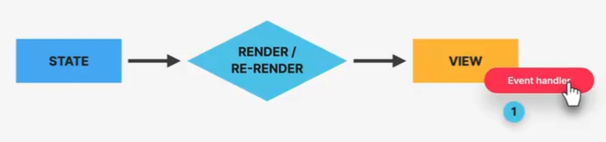
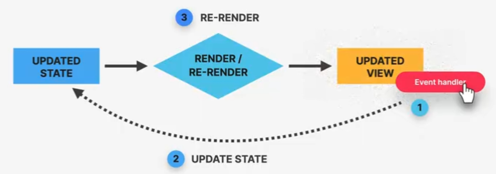
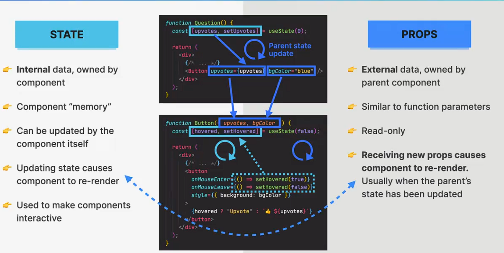

+++
title = '学习React第2章-状态'
date = 2024-09-26T13:30:39+08:00
draft = false
description = "这篇笔记介绍了React状态的概念、使用方法及其与道具的关系，并通过一个日历程序实例展示了状态管理和状态提升的实际应用。"
slug = "学习React第2章-状态"
image = "image-2.jpg"
categories = ["编程相关","前端"]
tags = ["JavaScript","React","JSX","前端","学习笔记","State"]
weight = 1       # You can add weight to some posts to override the default sorting (date descending)
keywords = ["JavaScript","React","JSX","前端","学习笔记","State"]
readingTime = true
+++

## 了解状态

在React中，`State`是一种用来存储组件内部状态的变量。

- 与上一章的`Props`在组件间传递状态相对的，状态这一变量代表了组件内部的情况，可以被看做组件的“内存”。


- 作为组件内部情况的代表，每当状态的量发生改变时，React会重新渲染整个组件。


综上，状态作为一种持久化的局部变量，允许我们在更改组件内容的同时重新渲染整个组件。


使用状态，就意味着我们用声明式的代码构造了用户界面，并让其随着时间推移发生变化。


## 状态工作流程

- 我们定义组件的状态变量，并在处理用户交互逻辑的`handler`函数中更新状态。




- 当用户与界面交互时，触发`handler`并更新状态。React检测到状态更新，于是重新渲染组件。



## 状态与道具



## 使用状态

### 何时使用状态


### 状态基本语法

```JSX
const [value, SetValue] = useState("init value");
console.log(value); // init value
SetValue("next value");
console.log(value) // next value
```

我们使用React的`useState()`函数生成一个状态的数组。数组第一位是状态变量本身，可以使用`useState()`函数的传入值来指定其初始值；数组第二位是更新状态变量的函数。实际应用中，要想**重新渲染组件**，就要使用数组中的**更新函数**来对状态进行更新。将状态定义成`let`或`var`都是无效的操作。

我们知道状态代表了组件内部的状态，因此在React中，状态**只能在组件内开头定义**。

实际使用中，我们还会使用更安全的方法来更新状态变量。

```JSX
SetValue((value)=>value+1);
```

### 派生状态

实际应用过程中，有些变量可以由状态*计算得到*，并在重新渲染的过程中*得到更新*。我们可以创建这种类型的`派生状态`。

```JSX
const [date,SetDate] = useState(new Date());

const month = date.getMonth()
const exdate = date.getDate()
const day = date.getDay()

return (
    <p>Today is {day} of {month} {exdate}.</p>
    )

```

实际编写过程中，为了**减少状态管理的难度**，我们应该尽量创建派生状态。

### 控制元素

我们可以使用状态量和设置状态函数来控制一些HTML元素的`value`和`handler`。

```JSX
<input
        type={"text"}
        value={count}
        onChange={(e) => handleInputChange(e)}
      />
```

在这个HTML的`input`文本框元素中，我们将其文本值设置为`count`状态，并在其值改变时调用`handleInputChange()`函数，并在其中更新`count`状态。

```JSX
function handleInputChange(e) {
    const t = e.target.value;
    setCount(t);
  }
```

### 状态提升

实际开发过程中，我们会在不同组件中创建*大量*的状态变量。然而由于React的*单向通信*原则，我们无法在*各个组件之间*使用道具来传递状态变量。因此，要让各个组件之间的状态互相*同步*，我们必须要将某个组件的状态提升到父节点上。

```JSX
function Count({ count, setCount }) {
  function handleInputChange(e) {
    const t = e.target.value;
    setCount(t);
  }

  return (
    <div style={{ textAlign: "center" }}>
      <button onClick={() => setCount((c) => Number(c) - 1)}>-</button>
      <input
        type={"text"}
        value={count}
        onChange={(e) => handleInputChange(e)}
      />
      <button onClick={() => setCount((c) => Number(c) + 1)}>+</button>
    </div>
  );
}
```

在这个`Count`组件中，我们使用到了`count`状态，但是却没有在`Count`组件内定义它，而是在它的父组件`App`内定义它。

```JSX
function App() {
  const [step, setStep] = useState(0);
  const [count, setCount] = useState(0);
  return (
    <>
      <Step step={step} setStep={setStep} />
      <Count count={count} setCount={setCount} />
      <DateP step={step} count={count} />
      <Reset setStep={setStep} setCount={setCount} step={step} count={count} />
    </>
  );
}
```

这样，所有`App`组件的子组件都可以使用`count`状态。当`Count`组件更新`count`状态时，所有`App`组件中的子组件也将正常重新渲染。

## 状态实战

我们制作一个日历程序，可以通过多种交互方式改变日期的描述。



首先分析程序中的状态。可以发现：

- `step`和`count`会根据交互而改变，并在不同的组件中被更新；
- 真实日期可以根据`step`和`count`计算得出。

因此，我们在父组件`App`中定义`step`和`count`状态，并将其作为道具传递给子组件。

```JSX
function App() {
  const [step, setStep] = useState(0);
  const [count, setCount] = useState(0);
  return (
    <>
      <Step step={step} setStep={setStep} />
      <Count count={count} setCount={setCount} />
      <DateP step={step} count={count} />
      <Reset setStep={setStep} setCount={setCount} step={step} count={count} />
    </>
  );
}
```

- 在`DataP`组件中，我们用`step`和`count`计算日期；

```JSX
function DateP({ step, count }) {
  let input = step * count;
  let date = new Date();
  let temp = date.getDate() + input;
  date.setDate(temp);
  date = date.toDateString();

  return (
    <p style={{ margin: 10, textAlign: "center" }}>
      {input !== 0 ? Math.abs(input) + " " : ""}
      {input !== 0 ? (input > 0 ? "Days from today " : "Days ago ") : "Today "}
      {input >= 0 ? "is" : "was"} {date}
    </p>
  );
}
```

在`Step`和`Count`组件中，我们控制HTML元素，将状态和交互绑定在一起。

```JSX
function Step({ step, setStep }) {
  function handleInputChange(e) {
    const n = e.target.value;
    setStep(n);
  }

  return (
    <div style={{ textAlign: "center" }}>
      <input
        type={"range"}
        min={"1"}
        max={"10"}
        value={step}
        onChange={(e) => handleInputChange(e)}
      />
      <span style={{ margin: 10 }}>Step: {step}</span>
    </div>
  );
}

function Count({ count, setCount }) {
  function handleInputChange(e) {
    const t = e.target.value;
    setCount(t);
  }

  return (
    <div style={{ textAlign: "center" }}>
      <button onClick={() => setCount((c) => Number(c) - 1)}>-</button>
      <input
        type={"text"}
        value={count}
        onChange={(e) => handleInputChange(e)}
      />
      <button onClick={() => setCount((c) => Number(c) + 1)}>+</button>
    </div>
  );
}
```

最后，我们添加一个`Reset`按钮组件，按下时就清空`count`和`step`状态。

```JSX
function Reset({ setStep, setCount, step, count }) {
  function handleReset() {
    setStep(0);
    setCount(0);
  }

  return (
    (step !== 0 || count !== 0) && (
      <div style={{ display: "flex", justifyContent: "center" }}>
        <button onClick={handleReset}>Reset</button>
      </div>
    )
  );
}
```

