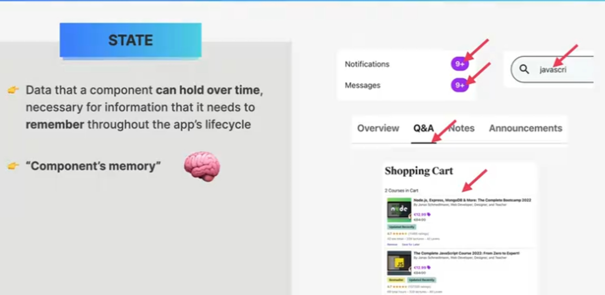
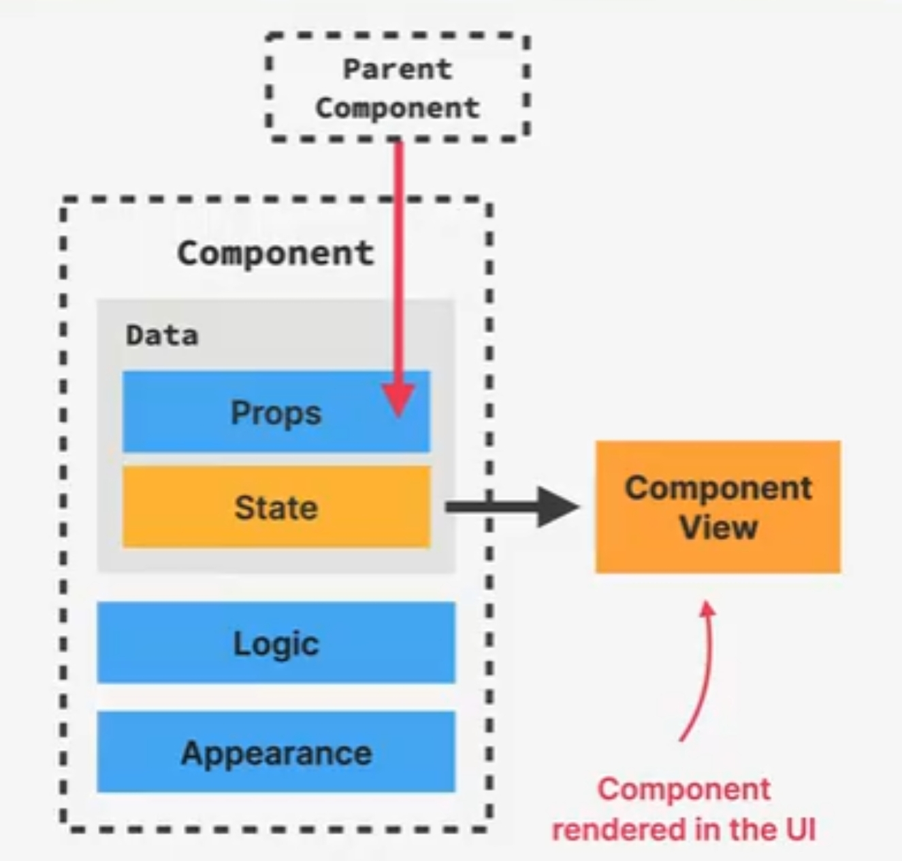
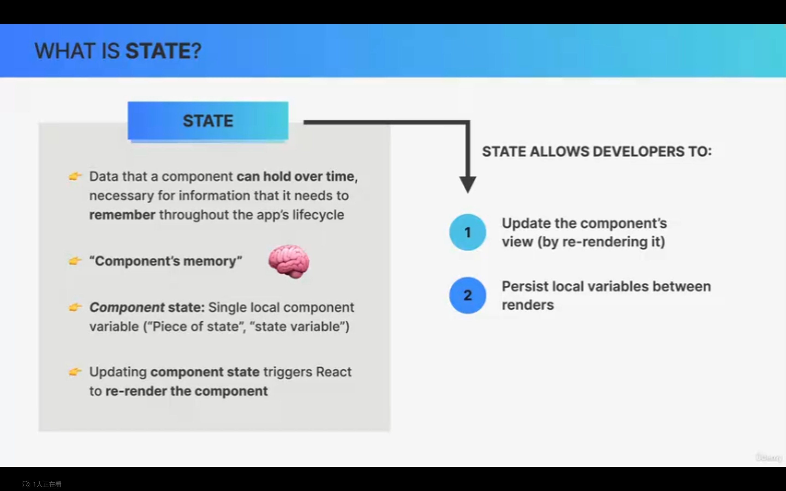
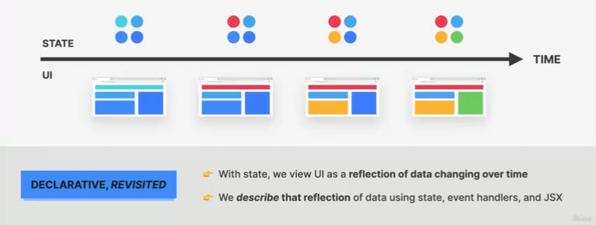
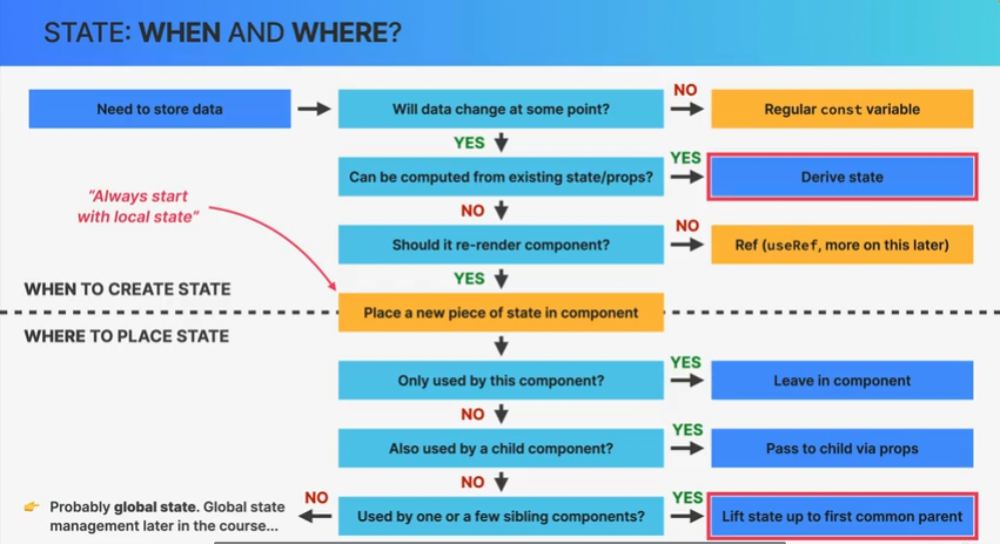

+++
title = '学习React第2章'
date = 2024-09-26T13:30:39+08:00
draft = false
description = "这篇笔记介绍了React的JSX语法、组件和道具的基本概念，并通过一个个人资料卡片的实例展示了如何使用这些概念构建React应用。"
slug = "学习React第2章"
image = "image-2.jpg"
categories = ["编程相关"]
tags = ["JavaScript","React","JSX","前端","学习笔记"]
weight = 1       # You can add weight to some posts to override the default sorting (date descending)
keywords = ["JavaScript","React","JSX","前端","学习笔记"]
readingTime = true
+++

## 了解状态

在React中，`State`是一种用来存储组件内部状态的变量。

- 与上一章的`Props`在组件间传递状态相对的，状态这一变量代表了组件内部的情况，可以被看做组件的“内存”。



- 作为组件内部情况的代表，每当状态的量发生改变时，React会重新渲染整个组件。



综上，状态作为一种持久化的局部变量，允许我们在更改组件内容的同时重新渲染整个组件。



使用状态，就意味着我们用声明式的代码构造了用户界面，并让其随着时间推移发生变化。



## 状态工作流程

- 我们定义组件的状态变量，并在处理用户交互逻辑的`handler`函数中更新状态。


- 当用户与界面交互时，触发`handler`并更新状态。React检测到状态更新，于是重新渲染组件。


## 使用状态

### 何时使用状态



### 状态基本语法

```JSX
const [value, SetValue] = useState("init value");
console.log(value); // init value
SetValue("next value");
console.log(value) // next value
```

我们使用React的`useState()`函数生成一个状态的数组。数组第一位是状态变量本身，可以使用`useState()`函数的传入值来指定其初始值；数组第二位是更新状态变量的函数。实际应用中，要想**重新渲染组件**，就要使用数组中的**更新函数**来对状态进行更新。将状态定义成`let`或`var`都是无效的操作。

我们知道状态代表了组件内部的状态，因此在React中，状态**只能在组件内开头定义**。

实际使用中，我们还会使用更安全的方法来更新状态变量。

```JSX
SetValue((value)=>value+1);
```

### 控制元素

我们可以使用状态量和设置状态函数来控制一些HTML元素。

```JSX
TODO
```

### 状态提升

实际开发过程中，我们会在不同组件中创建大量的状态变量。然而由于React的单向通信原则，我们无法在各个组件之间使用道具来传递状态变量。因此，要让各个组件之间的状态互相通信，我们必须要将某个组件的状态提升到父节点上。

对于需要使用状态变量并对其进行更新的子组件，我们可以在定义状态变量的父组件中

