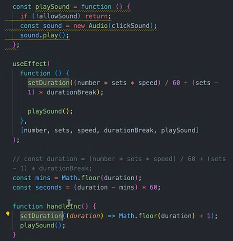
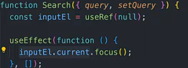

+++
title = '学习React第3章-更多钩子及其内部原理'
date = 2024-10-11T16:57:47+08:00
draft = false
description = "这篇笔记深入探讨了React的钩子，包括useState、useEffect和useRef，并解释了React的渲染机制、虚拟DOM、协调器和自定义钩子的使用方法。"
slug = "学习React第3章-钩子"
image = "image-5.png"
categories = ["编程相关","前端"]
tags = ["JavaScript","React","JSX","前端","学习笔记","State","Effect","Hook"]
weight = 1       # You can add weight to some posts to override the default sorting (date descending)
keywords = ["JavaScript","React","JSX","前端","学习笔记","State","Effect","Hook"]
readingTime = true
+++

在之前的学习过程中，我们使用到了`useState`，这就是一个React Hook。React的钩子函数在程序中以一种独特的方式运行。这篇笔记记录了一些React的运行机制，并从新的角度看待`useState`钩子，还会引入`useEffect`、`useRef`以及自定义钩子的使用。

## React的渲染过程

### React组件

我们在之前使用的组件函数实际上在React内部被解析成了React元素。React决定各个元素附带的DOM信息，并将其提交给浏览器进行渲染。

可以说，组件是React用来创建React元素的蓝图。

### React工作流程

之前有提到React会在触发源激活后对页面进行“重新渲染”。实际上，React不会直接进行渲染，它会将页面更改提交，并由其它引擎完成渲染。

React的两个触发源：

- 应用程序初始化；
- 状态变量更新。

### React渲染机制

上文提到的`Render Phase`，有一套固定的工作流程。简单来说，React会：

1. 将组件转换成React元素；
2. 映射一个虚拟DOM；
3. 借助协调器检测DOM中发生的变化；
4. 向平台提供更新完成后的DOM表。

#### 虚拟DOM

比起直接对浏览器的DOM进行操作，React会建立一个虚拟DOM，并在渲染过程中对其进行更改。

在虚拟DOM中，任意组件元素发生变化都会导致其子元素重渲染。

#### 协调器

更新完全部的DOM信息之后，React不会直接替换浏览器中陈旧的DOM信息，而是会进行`协调`过程。在这个过程中，`协调器`会找到DOM产生变化的部分，并在之后将这些将被修改的部分呈现给平台。

React目前使用`Fiber`节点搭建协调器。

在使用不同的组件时，我们应该给每个组件都附上不同的`key`属性。这样能够减少协调器在检查区别过程中的开销。

#### React 渲染器

协调过后，React将DOM的变化提交给渲染器。这些渲染器将对接不同的平台，并最终在不同的平台上完成渲染过程。

### React 渲染逻辑

React开发过程中，我们使用声明式的语言书写函数组件。在书写渲染逻辑的过程中，我们要避免产生代码副作用，影响React的正常运行。

### 钩子

在React中，需要注意钩子的使用限制：

- 仅在最高层使用钩子；
- 仅在React组件中使用钩子。

这是因为在协调过程中，React将钩子存储在链表中。手动对钩子产生副作用会使协调器无法追溯钩子的变化，从而影响React程序的正常执行。

## 深入了解React State

认识React的渲染过程后，可以发现状态变量更新是React渲染过程中很重要的一个环节。我们对React的状态变量也有了一些新的认识：

- 一个组件更新过程中，状态变量的真实情况总是对外部不可见，这意味着在我们看来，React总会将状态变量“打包”更新。

- 可以使用多种方式新建/更新状态变量。

## useEffect钩子

前文提到，我们不能在渲染逻辑中直接造成代码副作用。要与外界进行交互，我们需要使用`useEffect`钩子。

### 与eventhandler的区别

简单来说，二者的效果相同，但是执行的时间不同。

### 使用方法

除了获取外部API的数据，还可以使各种状态变量保持同步。

### 拆分Effect

为了保持变量同步，我们有时不得不在依赖数组中加入大量的对象。这样极容易导致状态更新导致的无限循环。

比如下图的代码中，使用`handleInc`handler时会造成`number`改变，就会触发useEffect中的`playSound`函数并强制重新计算`duration`，而这显然不是我们所希望的。

要解决这个问题，我们需要将现有的Effect根据功能的不同拆分成多个对应不同功能的Effect，确保Effect的依赖不会相互干涉，形成无限循环。

## useRef钩子

有时，我们需要在幕后工作的长期变量来追溯一些东西而不至于触发重渲染；这时我们可以使用`useRef`钩子。

### 和useState的比较

`useRef`钩子与`useState`钩子有一些相似与不同。

### 使用场景

- 可以用`useRef`来选择并储存DOM元素；

- 持久化储存需要追溯的变量。

## 自定义钩子

大部分时候我们会需要对副作用代码进行一定的封装。因此，我们可以定义`use`开头的钩子函数来封装我们的代码。

