+++
title = '学习React第4章-状态管理与上下文'
date = 2024-10-17T12:02:48+08:00
draft = false
description = "这篇笔记介绍了如何使用React的Reducer钩子和Context API进行状态管理，并详细讲解了Redux的使用方法及其与Context API的比较。"
slug = "学习React第4章-状态管理与上下文"
image = "image-1.png"
categories = ["编程相关"]
tags = ["JavaScript","React","JSX","前端","学习笔记","Redux"]
weight = 1       # You can add weight to some posts to override the default sorting (date descending)
keywords = ["JavaScript","React","JSX","前端","学习笔记","State","Reducer","Hook","Redux","Context"]
readingTime = true
+++

状态变量是React保持UI与数据同步的重要方式。本次我们会学习使用React库中的`Reducer`钩子和`React Context API`上下文来管理状态变量，消除之前组件中的大量无用道具。我们还要学习使用新版本的`Redux`进行状态管理。

## Reducer 钩子

随着项目的增大，仅使用`State`及其`setState`函数来管理状态显得力不从心。这时，使用`Reducer`钩子可以让我们在代码的某处统一管理状态。

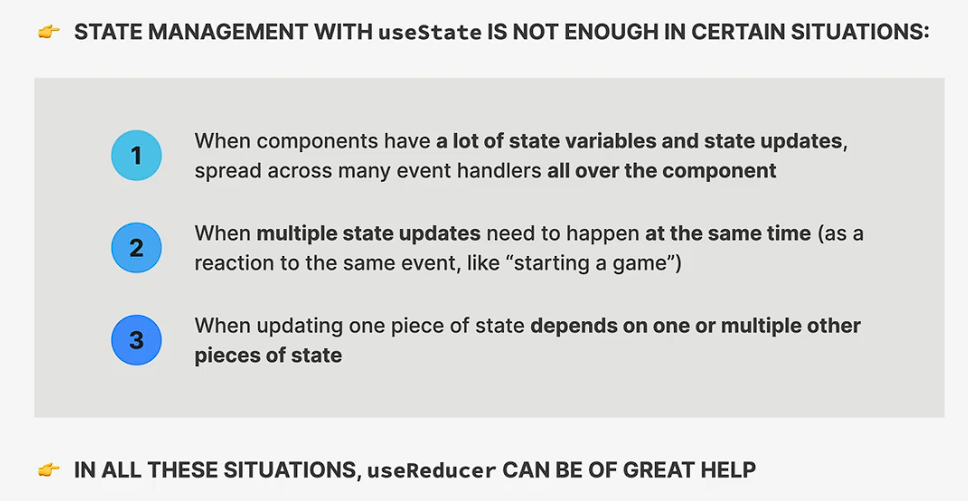

简单来说，若是多种状态变量产生了交涉，即某种状态变量的更新需要另一种状态变量，我们就应该考虑使用更专业的状态管理工具。

### 使用方法

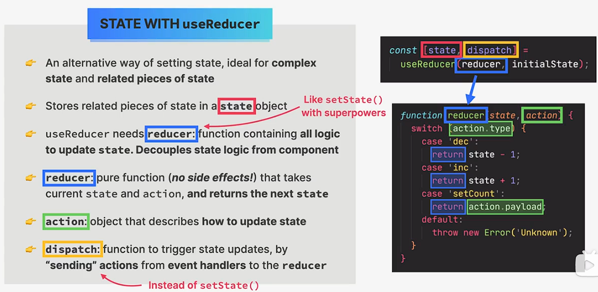

我们使用`useReducer`钩子创建`state`状态变量及其其设置函数`dispatch`。我们将`state`的初始值设置为一个对象，并在其中包含需要管理的各种状态变量。

然后，我们在自定义的`reducer`函数中设置对各种`action`的处理方法。

在开发过程中，我们通常对`action`进行封装，以区分`action`中的不同种类（`type`和`payload`）与载荷。

最后，我们在页面中取出当前的`state`并使用。


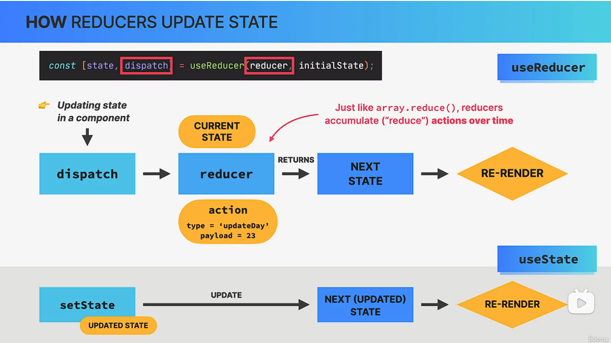

实际的代码中，我们使用`dispatch`而非原先的`setState`函数作为handler。其会触发`reducer`内的相关处理，并最后和`state`一样造成页面重渲染。

### useReducer与useState

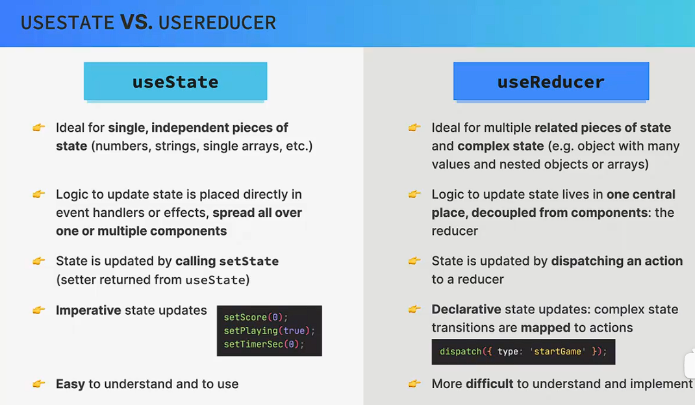

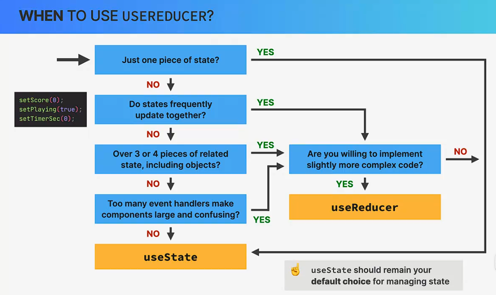

## Context API

在之前的开发中，我们简单地使用`props`来传递不同组件之间的状态变量，这导致组件中包含大量的冗余道具，影响了代码的可读性。一种解决方法就是使用`Context API`来全局地传递状态变量到需要的组件当中。

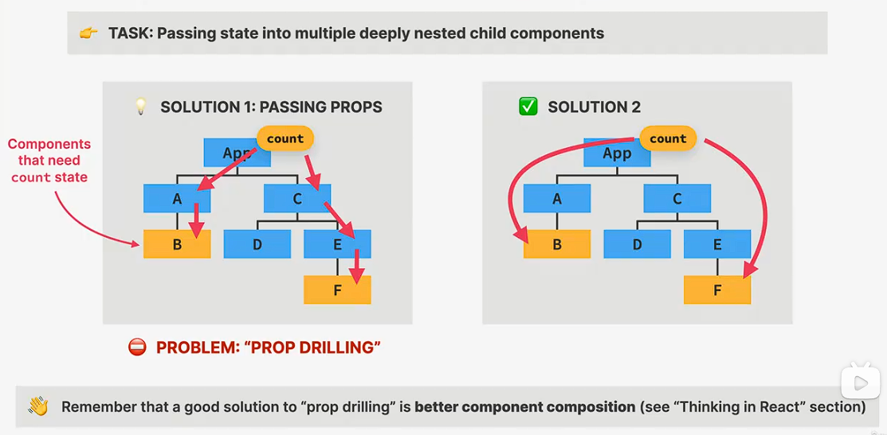

### 作用原理

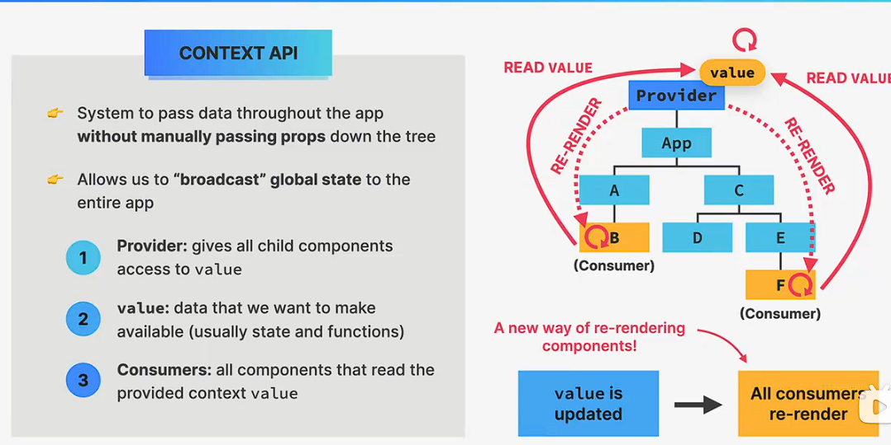

### 使用方法

- 创建、提供上下文；

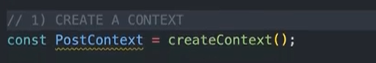

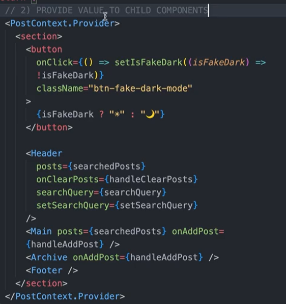

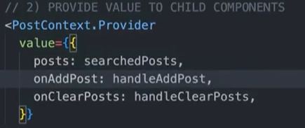

- 消费上下文。

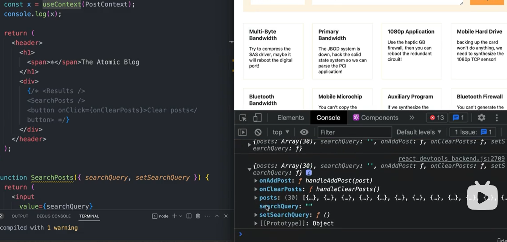

实际开发中，我们将上下文及其相关状态的新建等单独放置在一份js代码中，将上下文的`value`提前打包好。

```jsx
//PostContext.js

const PostContext = createContext();

function PostProvider({children}){
    //add state in this component
    //......
    return (<PostContext.Provider value={{/*...*/}}>
        {children}
        </PostContext.Provider>
    );
}

function usePosts(){
    //warp 'useContext' hook
    const context = useContext(PostContext);
    if(context) return context;
    else throw new Error("Outside of provider.");
}

export { PostProvider, usePost };

```

## Redux

Redux是一个用来管理全局状态的第三方库，集成了常用的状态管理、全局状态结局方案，可以用作大型程序的状态管理工具。

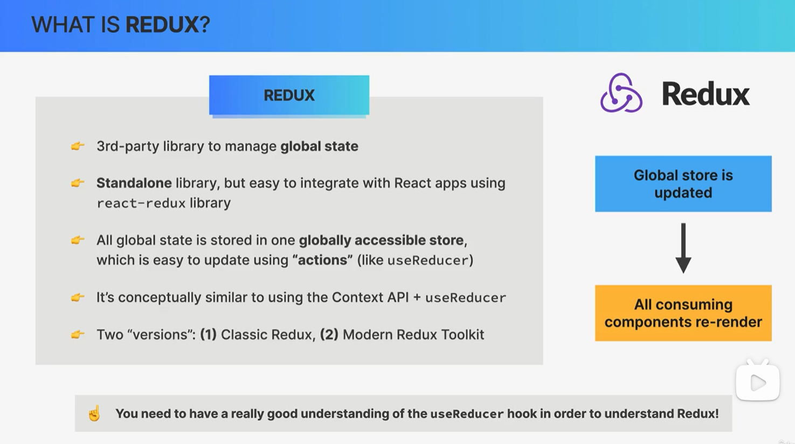

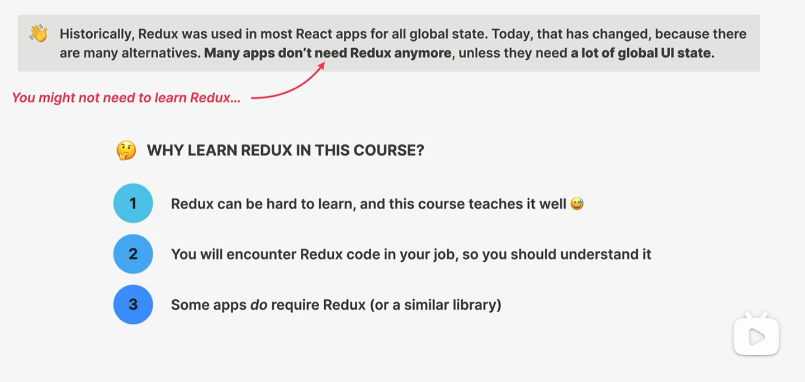

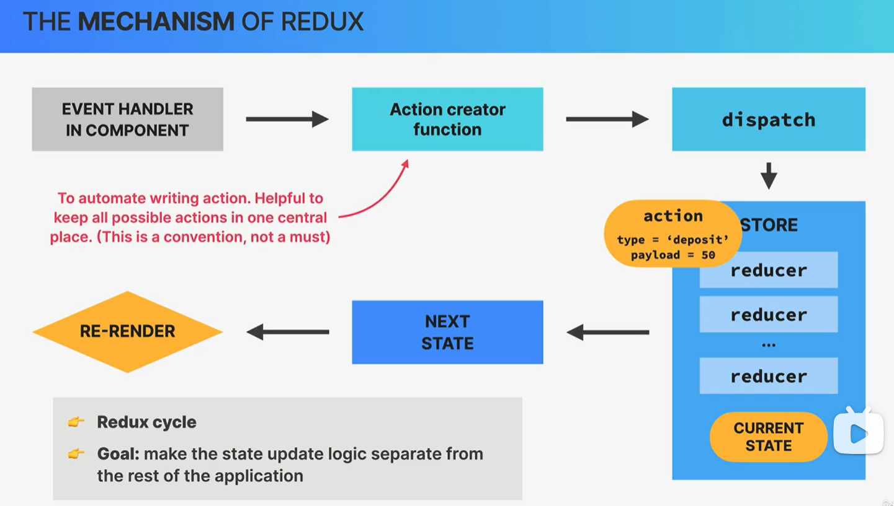

`Redux`和`Reducer`相近，都使用`dispatch`作为操作变量的入口。它们的区别体现在`Redux`使用一个store来储存多种reducer，`Reducer`使用一个reducer来对应不同的动作。

### 使用方法

- 使用`Redux Toolkit`的`configureStore`来创建`store`；

```jsx
import { configureStore } from "@reduxjs/toolkit";

import accountReducer from "./features/accounts/accountSlice";
import customerReducer from "./features/customers/customerSlice";

const store = configureStore({
  reducer: {
    account: accountReducer,
    customer: customerReducer,
  },
});

export default store;
```

- 使用`Redux-slice`来创建store中的reducer切片。

```jsx
import { createSlice } from "@reduxjs/toolkit";

const initialState = {
  fullName: "",
  nationalID: "",
  createdAt: "",
};

const customerSlice = createSlice({
  name: "customer",
  initialState,
  reducers: {
    createCustomer: {
      prepare(fullName, nationalID) {
        return {
          payload: {
            fullName,
            nationalID,
            createdAt: new Date().toISOString(),
          },
        };
      },
      reducer(state, action) {
        state.fullName = action.payload.fullName;
        state.nationalID = action.payload.nationalID;
        state.createdAt = action.payload.createdAt;
      },
    },
    updateName(state, action) {
      state.fullName = action.payload;
    },
  },
});

export const { createCustomer, updateName } = customerSlice.actions;

export default customerSlice.reducer;
```

- 在程序中使用`useDispatch`和`useSelect`来操作、读取状态变量。

```jsx
import { useState } from "react";
import { useDispatch } from "react-redux";
import { createCustomer } from "./customerSlice";

function Customer() {
  const [fullName, setFullName] = useState("");
  const [nationalId, setNationalId] = useState("");

  const dispatch = useDispatch();

  function handleClick() {
    if (!fullName || !nationalId) return;
    dispatch(createCustomer(fullName, nationalId));
  }

  return (
    //...
  );
}

export default Customer;
// account.js

import { useState } from "react";
import { useDispatch, useSelector } from "react-redux";
import { deposit, payLoan, requestLoan, withdraw } from "./accountSlice";

function AccountOperations() {
  const [depositAmount, setDepositAmount] = useState("");
  const [withdrawalAmount, setWithdrawalAmount] = useState("");
  const [loanAmount, setLoanAmount] = useState("");
  const [loanPurpose, setLoanPurpose] = useState("");
  const [currency, setCurrency] = useState("USD");

  const dispatch = useDispatch();
  //use selector
  const {
    loan: currentLoan,
    loanPurpose: currentLoanPurpose,
    balance,
    isLoading,
  } = useSelector((store) => store.account);
    //...
}
```

还可以使用中间件(`Middleware`)`Thunk`来在`Reducer`中引入副作用。

### 与Context API的比较

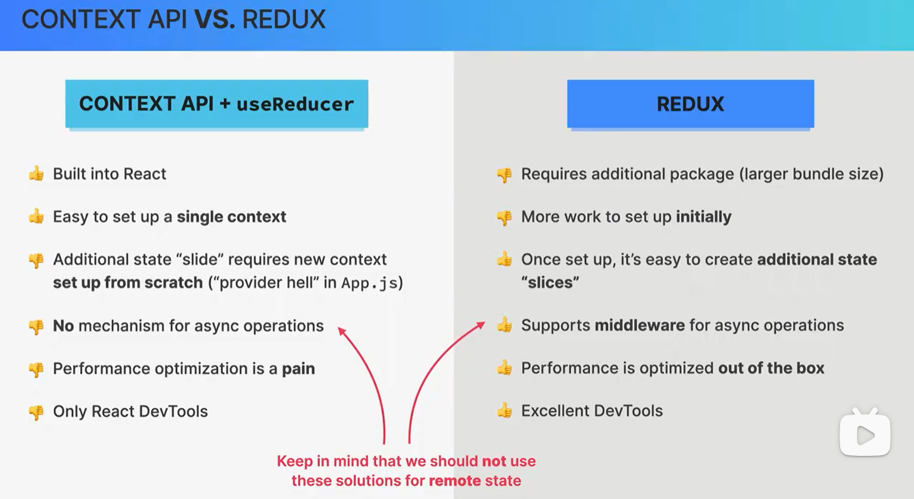

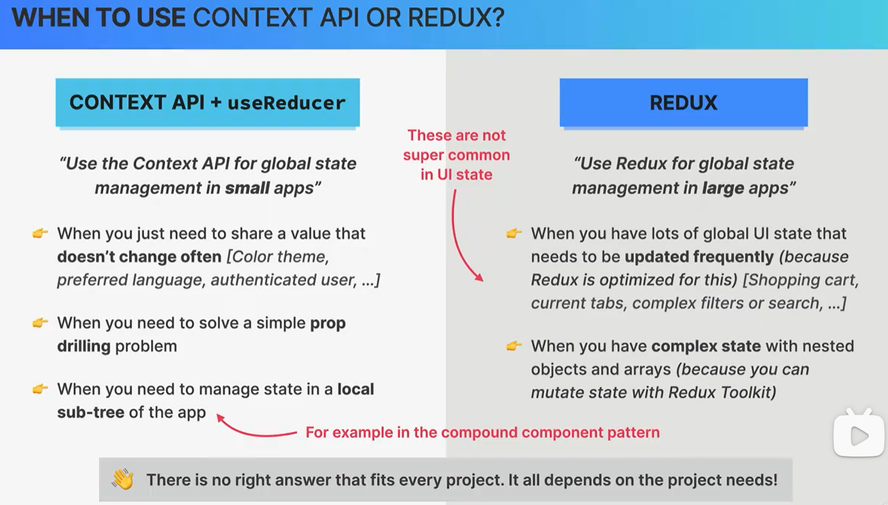

总的来说，Redux适合大型软件的开发，但是不够轻量化，使用难度也更高。我们需要根据`异步操作`和`性能`的需求来选择使用`Redux`或`Context API`进行状态管理。

## 状态管理总结

对SPA来说，可以归纳出以下四种状态变量：

- 本地状态，仅在某些子组件中存在；
- 全局状态，被大部分子组件使用；
- 远程状态，需要从外部API获取；
- UI状态，除远程状态外的状态。

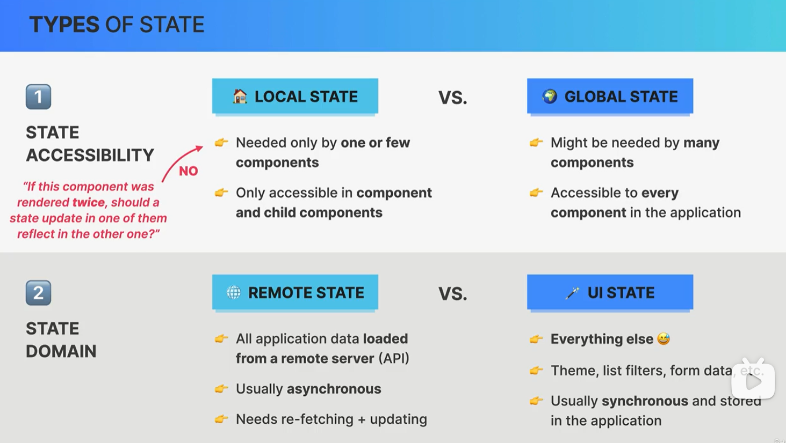

我们可以使用不同的工具，针对不同的状态进行管理。

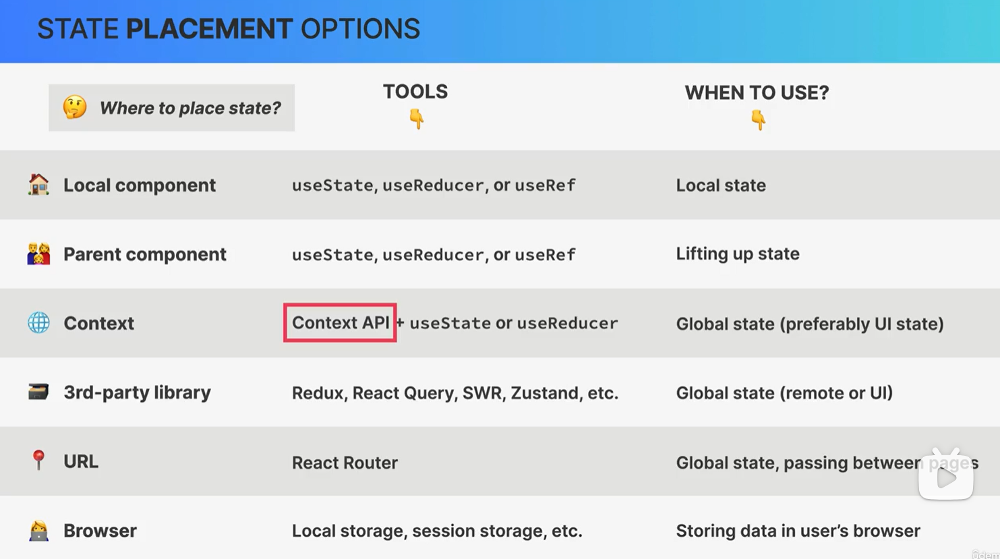

