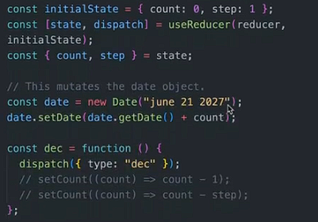

+++
title = '学习React第4章-状态管理与上下文'
date = 2024-10-17T12:02:48+08:00
draft = false
description = ""
slug = "学习React第4章-状态管理与上下文"
image = "image-1.png"
categories = ["编程相关"]
tags = ["JavaScript","React","JSX","前端","学习笔记","Hook"]
weight = 1       # You can add weight to some posts to override the default sorting (date descending)
keywords = ["JavaScript","React","JSX","前端","学习笔记","State","Reducer","Hook","Redux","Context"]
readingTime = true
+++

状态变量是React保持UI与数据同步的重要方式。本次我们会学习使用React库中的`Reducer`钩子和`React Context API`上下文来管理状态变量，消除之前组件中的大量无用道具。我们还要学习使用新版本的`Redux`进行状态管理。

## Reducer 钩子

随着项目的增大，仅使用`State`及其`setState`函数来管理状态显得力不从心。这时，使用`Reducer`钩子可以让我们在代码的某处统一管理状态。

简单来说，若是多种状态变量产生了交涉，即某种状态变量的更新需要另一种状态变量，我们就应该考虑使用更专业的状态管理工具。

### 使用方法

我们使用`useReducer`钩子创建`state`状态变量及其其设置函数`dispatch`。我们将`state`的初始值设置为一个对象，并在其中包含需要管理的各种状态变量。

然后，我们在自定义的`reducer`函数中设置对各种`action`的处理方法。

在开发过程中，我们通常对`action`进行封装，以区分`action`中的不同种类（`type`和`payload`）与载荷。

最后，我们在页面中取出当前的`state`并使用。

实际的代码中，我们使用`dispatch`而非原先的`setState`函数作为handler。其会触发`reducer`内的相关处理，并最后和`state`一样造成页面重渲染。

### useReducer与useState

## Context API

在之前的开发中，我们简单地使用`props`来传递不同组件之间的状态变量，这导致组件中包含大量的冗余道具，影响了代码的可读性。一种解决方法就是使用`Context API`来全局地传递状态变量到需要的组件当中。

### 作用原理

### 使用方法

