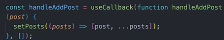

+++
title = '学习React第5章-性能优化'
date = 2024-10-17T21:00:50+08:00
draft = false
description = "这篇笔记介绍了React性能优化的方法，包括防止无必要的重渲染、提升应用响应速度、减少打包大小，并详细讲解了使用Profiler工具、memo、useMemo和useCallback进行优化的技巧。"
slug = "学习React第5章-性能优化"
image = "image-1.png"
categories = ["编程相关","前端"]
tags = ["JavaScript","React","JSX","前端","学习笔记","性能优化"]
weight = 1       # You can add weight to some posts to override the default sorting (date descending)
keywords = ["JavaScript","React","JSX","前端","学习笔记","性能优化"]
readingTime = true
+++

React开发过程中，我们有些时候会遇到一些大型组件产生性能问题，造成网页卡顿现象。这时，我们可以针对性地对这些问题进行优化。基本上，我们会从这几个方面考虑性能优化：

- 防止无必要的重渲染；
- 提升应用响应速度；
- 减少打包大小；

## 重渲染优化

有时，我们构造组件的方式会导致无效的重渲染。如果部分组件的渲染过程缓慢，这部分组件又被反复无用地重渲染，那么应用的相应速度就会被拖慢。

### 使用Profiler工具

在实际开发中，可以使用`React Developer Tool`插件中的`Profiler`工具来检测网站性能。

在选项卡中，你可以清楚的看到哪些组件触发了重渲染，以及重渲染的触发源。

### 组合组件避免重渲染

一些情况下，我们可以简单把缓慢组件作为`children`道具传入父组件。这样就能避免缓慢组件导致父组件中的其它子组件重新渲染。

### 使用memo、useMemo和useCallback

若缓慢组件在每次渲染的过程中几乎不发生变化，我们可以使用`memo`函数来将缓慢组件存入缓存。这样当冲渲染发生时，React检测到缓慢组件的内容未发生改变，就不会重新渲染这个组件。

#### memo函数

用`memo`函数包裹之前提到的缓慢组件`Archive`，可以发现React在父组件改变时忽略了`Archive`的重渲染，因为`Archive`本身的值并没有发生改变。

#### useMemo、useCallback钩子

在React中，如果有道具（对象、函数等）传递给了大型组件，那么每次重新渲染开始都会新建这些道具，造成`memo`失效。

这时，我们可以使用`useMemo`、`useCallback`钩子配合`memo`函数来记忆这些变量。

`useMemo`、`useCallback`使用了依赖数组。仅在依赖数组项变动时触发道具改变，进而触发组件重渲染。

## 优化打包大小

我们可以使用`lazyloading`技术，将大型Javascript文件按页面或组件分成不同的小文件，并让用户在使用过程中逐一加载代码文件。

## 性能优化原则

