+++
title = 'C++ Boost.MSM 状态机库实践'
date = 2026-02-22T21:54:00+08:00
draft = false
description = "在 RoboMaster 工程机器人中使用 Boost.MSM 实现优雅高效的状态管理"
categories = ["编程相关", "C++"]
tags = ["Boost", "状态机", "MSM", "PUML", "RoboMaster"]
weight = 1
keywords = ["Boost.MSM", "状态机", "PUML", "C++", "元编程"]
readingTime = true
+++

## 前言

在大型系统设计中，尤其是机器人控制系统，状态管理往往决定了代码的可维护性和可靠性。RoboMaster 工程机器人需要在抓取、存取、故障处理等多种模式间精确切换，传统的 if-else 或 switch 语句很难保证状态转换的正确性。本文介绍如何使用 **Boost.MSM**（Meta State Machine）库，结合 **PUML 图形化定义**，实现一套清晰、高效、易于维护的状态机系统。

---

## 为什么需要状态机

想象你的机器人在运行中需要处理以下场景：

- 启用/禁用系统
- 视觉抓取流程
- 矿物存取流程
- 实时错误处理与恢复

如果用传统的布尔标志和条件判断，代码会很快陷入"意大利面条式"的混乱。状态机提供了一套**形式化的方法**，确保：

1. **状态转换明确** — 每一步转换都有清晰的触发条件
2. **Guard 逻辑独立** — 转换条件与动作分离，易于测试
3. **可视化管理** — 用 PUML 图表示整个工作流程，一目了然

---

## 用 PUML 定义状态机

在 Boost 1.85 版本中，可以直接用 PUML（PlantUML）语言定义状态机，然后编译成代码。这样做的优势是：**一份 PUML 文件统一整个系统的状态定义**，无需在代码里重复硬编码。

### YandyArm 状态机的完整定义

```puml
@startuml YandyArm
skinparam state {
  BackgroundColor WhiteSmoke
  BorderColor DarkSlateGray
  FontSize 15
  FontColor Black
  Padding 12
  Margin 10
  BorderThickness 2
  RoundCorner 12
}

skinparam stateArrow {
  FontSize 12
  FontColor DarkBlue
}

' === 变量说明 ===
' bool mineral_attached: 当前末端是否有矿
' int stored_count: 仓库里有几个矿 (0, 1, 2)
' bool grip_sensor: 夹爪传感器状态

state YandyArm {
  ' 系统启动默认进入运作模式（的初始状态 Disabled）
  [*] -> Operational

  ' ============================================
  ' 正常运作模式
  ' ============================================
  state Operational {
    [*] -> Disabled

    state Disabled {
    }

    state ManualControl {
      ' 内部指令：不触发状态切换
      ManualControl -> ManualControl : -CMD_RESET / clear_accumulators
      ManualControl -> ManualControl : -CMD_SWITCH_GRIP / toggle_gripper
      ManualControl -> ManualControl : -CMD_TOGGLE_HELD / toggle_held_flag
      ManualControl -> ManualControl : -CMD_INC_STORE / inc_storage_count
      ManualControl -> ManualControl : -CMD_DEC_STORE / dec_storage_count

      ' 冲突报错
      ManualControl --> ManualControl : -CMD_SWITCH_STORE [store_logic_conflict] / log_store_conflict
    }

    state FetchingMode {
    }

    state StorageMode {
    }

    ' 启用/禁用
    Disabled ---> ManualControl : CMD_SWITCH_ENABLE / enable_output
    ManualControl ---> Disabled : CMD_SWITCH_ENABLE / disable_output

    ' 抓取流程
    ManualControl --> FetchingMode : CMD_SWITCH_FETCH / enter_fetch
    FetchingMode --> ManualControl : CMD_SWITCH_FETCH [grip_success] / fetch_success
    FetchingMode --> ManualControl : CMD_SWITCH_FETCH [!grip_success] / fetch_fail

    ' 存取流程
    ManualControl --> StorageMode : CMD_SWITCH_STORE [has_mineral && can_deposit] / move_to_deposit
    ManualControl --> StorageMode : CMD_SWITCH_STORE [!has_mineral && can_retrieve] / move_to_retrieve
    StorageMode --> ManualControl : CMD_SWITCH_STORE / store_finish
  }

  ' ============================================
  ' 故障模式
  ' ============================================
  state ErrorMode {
  }

  ' 全局转换
  Operational --> ErrorMode : CMD_ERROR / emergency_stop
  ErrorMode --> Operational : CMD_RESET / clear_error
}

@enduml
```



### PUML 语法快速入门

- **State 声明**：`state 名称 { ... }` 定义一个状态，支持嵌套
- **初始状态**：`[*] -> 状态名` 标记初始进入点
- **状态转换**：`状态A --> 状态B : 触发事件 [Guard] / Action`
  - `触发事件`：导致转换的命令（如 `CMD_SWITCH_ENABLE`）
  - `[Guard]`：可选的守卫条件（如 `grip_success`），决定是否允许转换
  - `Action`：执行的动作函数（如 `enable_output`）
- **内部转换**：`状态 -> 状态 : 事件 / Action` 不改变状态，仅执行动作
- **初始子状态**：在嵌套 state 中用 `[*] -> 子状态` 指定默认进入的子状态

---

## Boost.MSM 介绍

**Boost.MSM**（Meta State Machine）是 C++ 的一个高性能状态机库，它有两个关键特性：

### 1. 元编程实现 — 编译期性能优化

不同于运行时解析状态表，Boost.MSM 在**编译期**就确定了所有状态和转换。这意味着：

- **零开销抽象** — 状态转换和 Guard 检查都能内联，性能接近手写 switch
- **类型安全** — 编译器能检查所有状态和事件的有效性
- **可预测性** — 没有动态内存分配或反射开销

### 2. PUML 前端 — 可视化定义

从 Boost 1.85 开始，可以直接使用 PUML 文件作为状态机的"蓝图"。编译时，工具会将 PUML 转换为 C++ 前端定义，然后由编译器生成高效的后端状态机。

这样做的好处：

- **单一真实源** — 设计文档和代码从同一个 PUML 文件生成
- **易于迭代** — 修改流程只需改 PUML，无需修改复杂的 C++ 模板代码
- **团队协作** — 非编程人员也能理解和评审状态流程

---

## 代码详解

### 第一步：定义 Action（动作）

当状态转换发生时，执行的具体操作由 **Action** 完成。在 Boost.MSM 中，每个 Action 都是一个特化的模板：

```cpp
namespace boost::msm::front::puml {

template <> struct Action<by_name("enable_output")> {
  template <class EVT, class FSM, class S, class T>
  void operator()(EVT const&, FSM& fsm, S&, T&) {
    fsm.m_logger->info("系统已启用，进入手动控制模式");
  }
};

template <> struct Action<by_name("disable_output")> {
  template <class EVT, class FSM, class S, class T>
  void operator()(EVT const&, FSM& fsm, S&, T&) {
    fsm.m_logger->info("系统已禁用");
  }
};

}
```

**关键点：**

- `Action<by_name("...")>` 模板按**PUML 中定义的 Action 名称**进行特化
- `operator()` 的四个参数：
  - `EVT`：触发的事件类型
  - `FSM`：状态机自身（可访问数据成员和 logger）
  - `S`、`T`：源状态和目标状态类型
- 在 Action 中可以直接访问 FSM 的公共成员（如 `mineral_attached`、`stored_count`）

### 第二步：实现核心流程（抓取 & 存取）

#### 抓取流程（Fetching）

```cpp
template <> struct Action<by_name("enter_fetch")> {
  template <class EVT, class FSM, class S, class T>
  void operator()(EVT const&, FSM& fsm, S&, T&) {
    fsm.m_logger->info("启动视觉抓取流程...");
    // fsm.hardware_move("视觉识别坐标");
    // fsm.hardware_grip(true);  // 张开
    fsm.m_logger->info("[提示] 请操作摇杆微调位置，再次发送指令以抓取。");
  }
};

template <> struct Action<by_name("fetch_success")> {
  template <class EVT, class FSM, class S, class T>
  void operator()(EVT const&, FSM& fsm, S&, T&) {
    // fsm.hardware_grip(false);  // 闭合
    fsm.mineral_attached = true;
    // fsm.hardware_move("FETCH_READY_POS");
    fsm.m_logger->info("抓取成功！已返回原位");
  }
};

template <> struct Action<by_name("fetch_fail")> {
  template <class EVT, class FSM, class S, class T>
  void operator()(EVT const&, FSM& fsm, S&, T&) {
    // fsm.hardware_grip(false);
    fsm.mineral_attached = false;
    // fsm.hardware_move("FETCH_READY_POS");
    fsm.m_logger->warn("传感器未检测到物体！抓取失败，已返回。");
  }
};
```

整个抓取流程分为三步：

1. **进入 FetchingMode** — `enter_fetch` 打开夹爪，提示操作者微调位置
2. **再次发送指令** — 检查传感器状态，触发 `fetch_success` 或 `fetch_fail`
3. **返回 ManualControl** — 更新 `mineral_attached` 标志

#### 存取流程（Storage）

存取稍复杂一些。根据当前手中是否有矿物，同一个 `CMD_SWITCH_STORE` 事件有不同的含义：

```cpp
template <> struct Action<by_name("move_to_deposit")> {
  template <class EVT, class FSM, class S, class T>
  void operator()(EVT const&, FSM& fsm, S&, T&) {
    fsm.m_logger->info("准备存矿...");
    // fsm.hardware_move("STORAGE_BIN_POS");
    fsm.m_logger->info("[提示] 请微调位置，再次发送指令以放置。");
  }
};

template <> struct Action<by_name("move_to_retrieve")> {
  template <class EVT, class FSM, class S, class T>
  void operator()(EVT const&, FSM& fsm, S&, T&) {
    fsm.m_logger->info("准备取矿...");
    // fsm.hardware_move("STORAGE_BIN_POS");
    // fsm.hardware_grip(true);  // 张开准备取
    fsm.m_logger->info("[提示] 请微调位置，再次发送指令以抓取。");
  }
};

template <> struct Action<by_name("action_store_finish")> {
  template <class EVT, class FSM, class S, class T>
  void operator()(EVT const&, FSM& fsm, S&, T&) {
    if (fsm.mineral_attached) {
      // 存矿动作
      // fsm.hardware_grip(true);  // 张开扔掉
      fsm.mineral_attached = false;
      ++fsm.stored_count;
      fsm.m_logger->info("存矿完成");
    } else {
      // 取矿动作
      // fsm.hardware_grip(false);  // 闭合抓取
      fsm.mineral_attached = true;
      --fsm.stored_count;
      fsm.m_logger->info("取矿完成");
    }
    // fsm.hardware_move("HOME_POS");
  }
};
```

这种设计很优雅：一个 `store_finish` Action 根据当前的 `mineral_attached` 状态，**自动判断是存还是取**。无需重复代码。

### 第三步：定义 Guard（守卫条件）

Guard 决定了转换是否**真正发生**。它是一个布尔谓词，在事件被处理时先被评估。

```cpp
// 检查是否有矿
template <> struct Guard<by_name("has_mineral")> {
  template <class EVT, class FSM, class S, class T>
  bool operator()(EVT const&, FSM& fsm, S&, T&) {
    return fsm.mineral_attached;
  }
};

// 检查抓取传感器
template <> struct Guard<by_name("grip_success")> {
  template <class EVT, class FSM, class S, class T>
  bool operator()(EVT const&, FSM& fsm, S&, T&) {
    // return fsm.check_grip_sensor();
    return true;
  }
};

// 检查能否存 (库存 < 2)
template <> struct Guard<by_name("can_deposit")> {
  template <class EVT, class FSM, class S, class T>
  bool operator()(EVT const&, FSM& fsm, S&, T&) {
    return fsm.stored_count < 2;
  }
};

// 检查能否取 (库存 > 0)
template <> struct Guard<by_name("can_retrieve")> {
  template <class EVT, class FSM, class S, class T>
  bool operator()(EVT const&, FSM& fsm, S&, T&) {
    return fsm.stored_count > 0;
  }
};

// 检查逻辑冲突：(有矿 但 满了) 或 (没矿 但 空了)
template <> struct Guard<by_name("store_logic_conflict")> {
  template <class EVT, class FSM, class S, class T>
  bool operator()(EVT const&, FSM& fsm, S&, T&) {
    if (fsm.mineral_attached && fsm.stored_count >= 2) return true;
    if (!fsm.mineral_attached && fsm.stored_count <= 0) return true;
    return false;
  }
};

// 复合 Guard
template <> struct Guard<by_name("has_mineral && can_deposit")> {
  template <class EVT, class FSM, class S, class T>
  bool operator()(EVT const&, FSM& fsm, S&, T&) {
    return fsm.mineral_attached && (fsm.stored_count < 2);
  }
};

template <> struct Guard<by_name("!has_mineral && can_retrieve")> {
  template <class EVT, class FSM, class S, class T>
  bool operator()(EVT const&, FSM& fsm, S&, T&) {
    return !fsm.mineral_attached && (fsm.stored_count > 0);
  }
};
```

**Guard 的设计原则：**

1. **无副作用** — Guard 只读取状态，不修改任何数据（这样可以安全地在尝试转换时多次调用）
2. **原子条件** — 每个 Guard 代表一个清晰的业务规则（如"库存满了"、"有矿"）
3. **早期冲突检测** — 用 Guard 捕捉逻辑错误，防止非法状态转换

### 第四步：前端到后端的连接

定义好 Action 和 Guard 后，需要将 PUML 内容嵌入 FSM：

```cpp
namespace yandy::modules {
namespace msm = boost::msm;
namespace detail {
  using namespace msm::front::puml;

  class YandyArmFSMDef : public msm::front::state_machine_def<YandyArmFSMDef> {
  public:
    YandyArmFSMDef() {
      m_logger = core::create_logger("YandyArmFSM", spdlog::level::info);
    }

    // 从编译时生成的 PUML 内容声明状态表
    BOOST_MSM_PUML_DECLARE_TABLE(YANDY_ARM_PUML_CONTENT);

    // 未定义转换时的处理
    template <class FSM, class Event>
    void no_transition(Event const&, FSM&, int) {
      m_logger->warn("当前状态不支持此指令");
    }

    std::shared_ptr<spdlog::logger> m_logger;
    bool mineral_attached = false;
    int stored_count = 0;
  };

  // 后端类型：11 表示使用 C++11 变体（high performance）
  typedef msm::back11::state_machine<YandyArmFSMDef> YandyArmFSMBackend;
}

class YandyArmFSM {
public:
  YandyArmFSM();

  void processCmd(YandyControlCmd cmd);
  void logState() const;
  YandyState getState() const;

  bool hasMineralAttached() const { return m_fsm.mineral_attached; }
  int getStoredCount() const { return m_fsm.stored_count; }

private:
  detail::YandyArmFSMBackend m_fsm;
  std::shared_ptr<spdlog::logger> m_logger;
  void sync_state();
  std::atomic<YandyState> m_current_state{YandyState::Disabled};
};

}
```

**关键点：**

- `BOOST_MSM_PUML_DECLARE_TABLE(YANDY_ARM_PUML_CONTENT)` 宏会在编译时展开为状态转换表
- `msm::back11::state_machine` 是高性能后端，使用模板元编程生成最优代码
- `no_transition` hook 用于调试，当事件在当前状态下无效时记录警告
- `YandyArmFSM` 是公开的包装类，隐藏 MSM 细节，提供简洁的接口

---

## 常见陷阱与设计建议

### 1. Guard vs 条件分支

**错误做法：** 在 Action 中进行条件判断

```cpp
template <> struct Action<by_name("fetch")> {
  void operator()(EVT const&, FSM& fsm, S&, T&) {
    if (fsm.mineral_attached) {
      // ...
    }
  }
};
```

**正确做法：** 用多条转换路径 + Guard

```puml
ManualControl --> StorageMode : CMD_SWITCH_STORE [has_mineral && can_deposit] / move_to_deposit
ManualControl --> StorageMode : CMD_SWITCH_STORE [!has_mineral && can_retrieve] / move_to_retrieve
```

Guard 让状态转换**显式且可追踪**，更易于维护和调试。

### 2. 内部转换 vs 状态迁移

**内部转换** — 不改变状态，仅执行动作：

```puml
ManualControl -> ManualControl : -CMD_RESET / clear_accumulators
```

**状态迁移** — 离开当前状态，进入新状态：

```puml
ManualControl --> FetchingMode : CMD_SWITCH_FETCH / enter_fetch
```

这个区别很重要：内部转换**不触发** entry/exit 回调，性能更高。

### 3. 数据一致性与 Guard

Guard 不应该修改状态。如果 Guard 需要读取多个字段，确保这些字段在逻辑上是**一致的**。例如：

```cpp
// ✓ 正确：检查一致性
if (mineral_attached && stored_count < 2) return true;

// ✗ 错误：修改状态
fsm.mineral_attached = !fsm.mineral_attached;
```

### 4. 错误恢复设计

从 ErrorMode 回到 Operational：

```puml
ErrorMode --> Operational : CMD_RESET / clear_error
```

`clear_error` Action 应该**重置所有异常标志**，确保系统状态清晰。

---

## 测试与调试

### 验证状态转换

```cpp
YandyArmFSM fsm;

// 初始状态应该是 Disabled
assert(fsm.getState() == YandyState::Disabled);

// 发送启用命令
fsm.processCmd(YandyControlCmd::CMD_SWITCH_ENABLE);
assert(fsm.getState() == YandyState::ManualControl);

// 尝试存矿，但库存已满 — Guard 应该阻止转换
fsm.stored_count = 2;
fsm.mineral_attached = true;
fsm.processCmd(YandyControlCmd::CMD_SWITCH_STORE);
// logState() 应该输出：逻辑冲突！手持状态与库存状态不匹配，无法执行。
```

### 日志追踪

每个 Action 都应该记录日志，方便问题排查。结合 spdlog，可以生成时间序列的状态转换记录。

---

## 总结

Boost.MSM 和 PUML 的结合为大型系统的状态管理提供了**优雅而高效**的解决方案：

1. **PUML 定义** — 直观的图形化规范，文档与代码同步
2. **编译期优化** — 元编程保证零开销抽象，性能接近手写
3. **清晰分离** — Action、Guard、状态转换各司其职，易于单元测试
4. **可维护性** — 修改流程无需修改核心 C++ 代码，风险低

如果你的项目涉及复杂的状态管理，尤其是嵌入式和机器人控制系统，不妨尝试 Boost.MSM。一旦掌握了这套模式，代码会变得意外地清晰和健壮。

---

## 参考资源

- Boost.MSM 官方文档：https://www.boost.org/doc/libs/latest/doc/antora/msm/index.html
- PlantUML 状态机语法：https://plantuml.com/state-diagram
